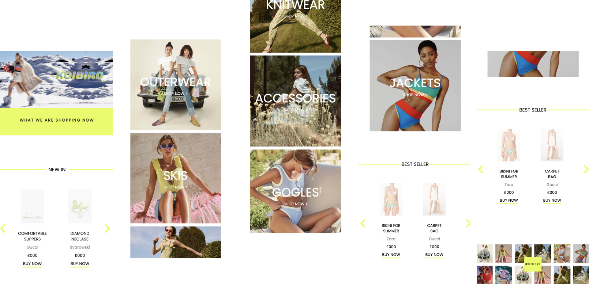
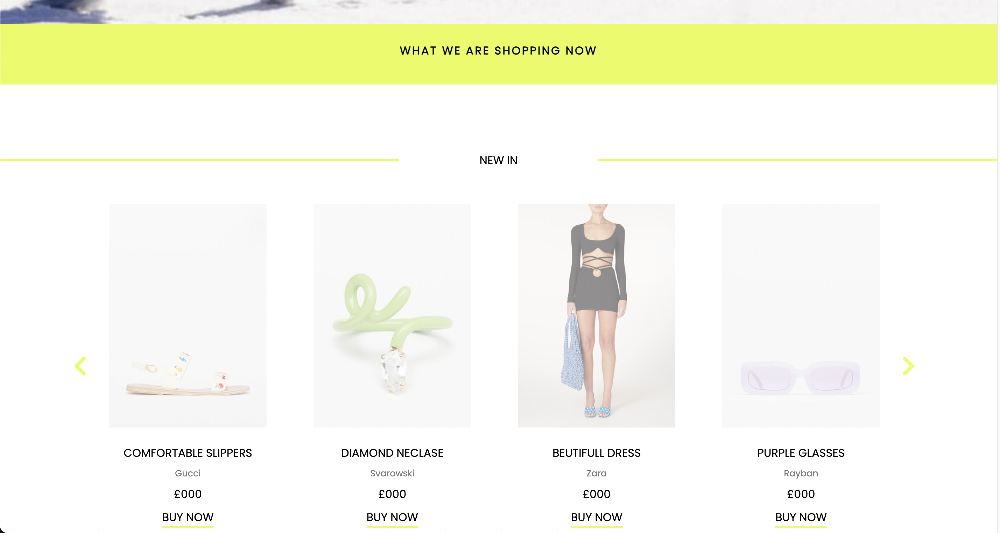
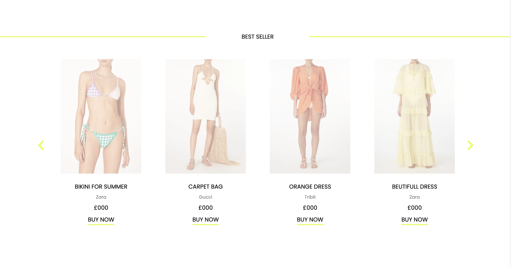

# e-Commerce-website

- The layout for Tablet it's the same as mobile, the only difference that photo collection grid shows **2** photos in a column instead of **1**.
- It's compatible with 4 last browser versions.
- Prefixer added to support different browsers.

## Screenshots

### Mobile
<p align="center">

</p>

### Laptop
<p align="center">

</p>
<p align="center">

</p>
<p align="center">

</p>
<p align="center">

</p>
<p align="center">

</p>

## Getting Started

1. Clone repo

```
git clone -> https://github.com/Jonas-Petrauskas/e-Commerce-website.git
```
2. Install dependencies
```
Root folder  -> npm install
```
